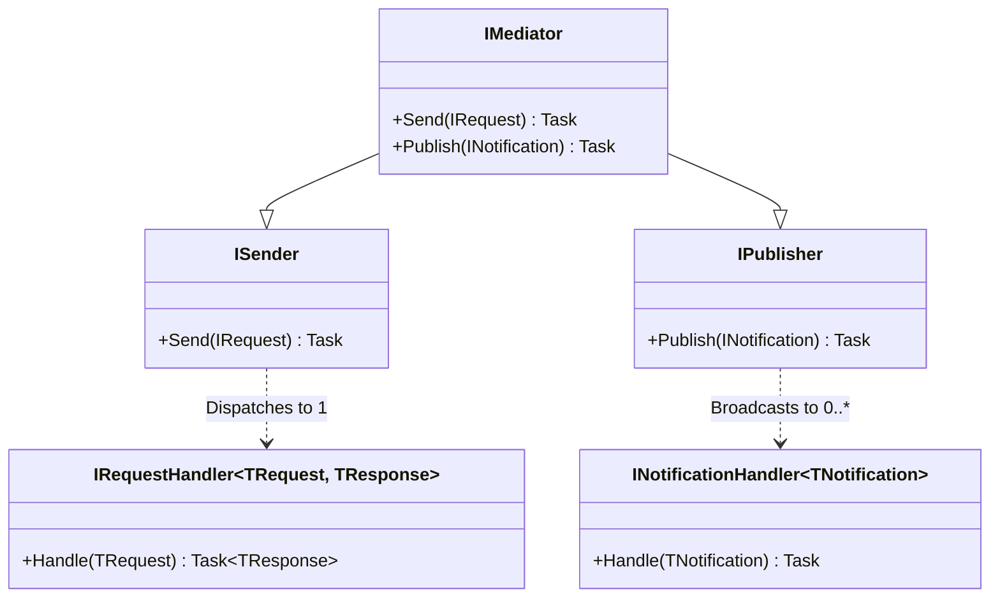

# Introduction to Concordia

Concordia is a high-performance, open-source adoption of the **Mediator pattern** for .NET. It is designed to be the backbone of loosely coupled architectures, enabling clean separation of concerns through a unified dispatching mechanism.

## Philosophy

Concordia was born from a desire to return to the core principles of the Mediator pattern while leveraging modern .NET advancements.

### 1. Open Source & Accessible
We believe that foundational architectural patterns should remain democratized. In an ecosystem where some popular libraries are transitioning to paid commercial licenses, Concordia stands as a free, MIT-licensed alternative that refuses to compromise on quality or features.

### 2. Performance First
Runtime reflection is costly, especially during application startup. Concordia embraces **Source Generators** to perform handler discovery and registration at **compile-time**. This results in:
- **Zero Startup Overhead**: No assembly scanning at runtime.
- **Trimming Compatibility**: Fully compatible with AOT (Ahead-of-Time) compilation.
- **Immediate Feedback**: Compile-time errors if handler configurations are invalid.

### 3. Simplicity without Compromise
We provide a minimal API surface that closely mirrors established standards (like MediatR), ensuring that developers feel at home immediately. Complex behaviors like pipelines, notifications, and streaming are supported, but they never clutter the core usage.

## Architecture Overview

At its heart, Concordia is a message dispatcher. It decouples the *Sender* of a request from the *Receiver* (Handler) that processes it.

### Core Components
- **ISender**: Responsible for dispatching a command or query to exactly one handler. It expects a response (or a void completion).
- **IPublisher**: Responsible for broadcasting a notification to multiple subscribers. It implements a "fire-and-forget" or "await-all" strategy depending on configuration.
- **IMediator**: A facade that combines both `ISender` and `IPublisher` for convenience.

## Concordia vs. MediatR

While Concordia shares the same interface signatures as MediatR to facilitate migration, the underlying internal mechanics are fundamentally different.

| Feature | Concordia | MediatR |
| :--- | :--- | :--- |
| **Handler Discovery** | **Compile-Time** (Source Generators) | **Runtime** (Reflection / Assembly Scanning) |
| **Startup Speed** | Instant (Zero-Cost) | Proportional to Assembly Size |
| **AOT Support** | Native / First-Class | Requires Manual Configuration |
| **License** | MIT (Free Forever) | Paid (v12+) / Apache 2.0 (Older) |
| **Dependency Injection** | `Microsoft.Extensions.DependencyInjection` | `Microsoft.Extensions.DependencyInjection` |

## Next Steps

Ready to dive in?
- **[Installation Guide](installation.html)**: Learn how to set up Concordia in your project.
- **[Mediator Patterns](mediator/commands.html)**: Explore Commands, Queries, and Notifications.
- **[Pipelines](mediator/pipelines.html)**: Implement cross-cutting concerns like validation and logging.
